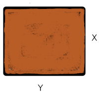
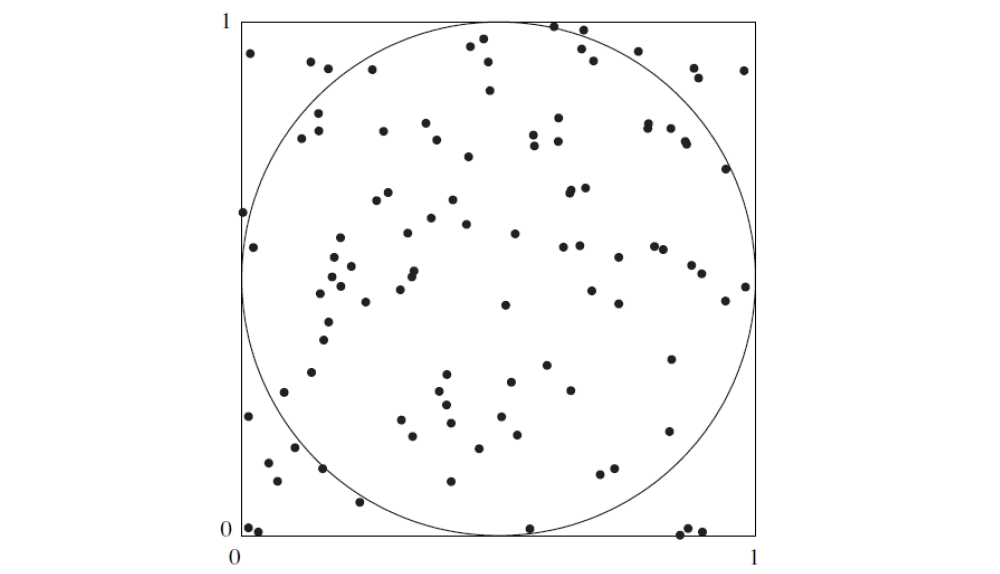

```{r setup, include=FALSE}
library(learnr)
knitr::opts_chunk$set(echo = FALSE,
                 exercise.warn_invisible = FALSE)
```


</br>

```{r, echo=FALSE, out.width="100%", fig.align = "center"}
knitr::include_graphics("images/banner1.jpg")
```

</br></br>

## Presentación 

El presente Taller contiene tres situación reales en que se utiliza R que pretenden realizar un primer acercamiento a este lenguaje estadísitco

</br>

##### **Que es R** 

```{r, echo=FALSE, out.width="10%", fig.align = "center"}
knitr::include_graphics("images/logoR.png")
```


Es un lenguaje para la computación  estadística, utilizado para el procesamiento de información y generación de modelos estadísticos. Entre las principales caractarísticas  estan:

   + Licencia (GNU GPL)  abierta y gratis
   
   + Creciente popularidad en Ciencia de Datos

   + Multipalataforma (UNIX, Windows, MacOS)

   + Ross Ihaka y Robert Gentieman (U.Auckland - Nueva Zelanda) 1993

   + Lenguaje multiparadigma
   
   + Codigo construido en C y Fortran
   
   + Gran comunidad muy activa 
   
   + Mas de 7000 paquetes 


</br>

## Tema 1

### Ejercicios de analisis de datos

**1. Importar datos en R**  : Se puede realizar de formas diferentes :
 

1. Cargar bases de datos contenidas al interior de un paquete de R

2. Utilizando el menú RStudio 
  + Caso formato .csv : *File /Import Dataset/From text (base)*. 
  + Caso formato .xlsx : *File/ Import Dataset/ From Excel*. 

3. Utilizando el paquete `Rcmdr` y `RcomdrMisc` que activa una interfas de R que trabaja con menus y ventanas con un proceso parecido al anterior

Los anteriores caso implican que tengamos la base de datos descargada en una carpeta de nuestro PC

4. Podemos importar la base de datos de un repositorio que maneje API que es un permiso a través de un token. En este caso debemos solicitar el token e instalar el paquete RSocrata

</br></br>

Caso 1.  Importar data del interior de R

**iris**

```{r ej11, exercise=TRUE, exercise.lines = 15}


```

```{r ej11-hint}
data(iris)  # data set iris
boxplot(iris$Sepal.Length~iris$Species) # grafico de cajas
head(iris)  # visualiza data
summary(iris) # resumen de variables

```


```{r, echo=FALSE, out.width="70%", fig.align = "center"}

```

</br></br>

**Titanic**

```{r ej12, exercise=TRUE, exercise.lines = 15}


```

```{r ej12-hint}
install.packages("titanic")
library(titanic)
data("Titanic")

```

```{r, echo=FALSE, out.width="50%", fig.align = "center"}

```

</br></br>


Caso 2. Importar datos desde un archivo csv en nuestro computador

+ Caso formato .csv : *File /Import Dataset/From text (base)*. 
+ Caso formato .xlsx : *File/ Import Dataset/ From Excel*.


</br></br>

Caso 3. Importar data del portal de bases de datos abiertos Colombia

**Covid-19**

```{r ej14, exercise=TRUE, exercise.lines = 15}

```


```{r ej14-hint}
install.packages("RSocrata", dependencies = TRUE)   # instalación de paquete RSocrata
library(RSocrata)    # llamado de libreria
token <- "zxMsD6eXc0zlEMryRGW87Hwrz"  # token
Colombia <- read.socrata("https://www.datos.gov.co/resource/gt2j-8ykr.json", app_token = token) # lectura 
saveRDS(Colombia, file = "Colombia.RDS")
```

## Tema 2

### Ejercicios de sumulación

#### **Problema 1** 

Se fabrican placas rectangulares cuyas longitudes en pulgadas se distribuyen como $N(2.0; 0.01)$ y cuyos anchos se distribuyen $N(3.0; 0.04)$. Suponga que las longitudes y los anchos son independientes. El área de una placa esta dada por $A=XY$.

```{r, echo=FALSE, out.width="20%", fig.align = "center"}

```


a. Utilice una muestra simulada de tamaño $1000$ para estimar la media y la varianza de $A$.

b. Estime la probabilidad de que $P(5.9 <A<6.1)$.

c. Construya una gráfica de distribución normal $(qqplot)$ para el área. ¿El área de una placa sigue una distribución normal? 

Problema 3 capitulo 4 Navidi(2006) 

<br/>


```{r ej32, exercise=TRUE, exercise.lines = 15}


```

```{r ej32-hint}
n=1000
X2=rnorm(n,mean=2.0,sd=0.1)    #  generación de números aleatorios  de X
Y2=rnorm(n,mean=3.0,sd=0.2)    #  generación de números aleatorios  de Y
Z2=data.frame(X2,Y2)              #  generación de matriz de X,Y
A2=apply(Z2,1,prod)               #  área de la placa A=XY
mediaA=mean(A2)                   #  media del vector de áreas 
varianzaA=var(A2)                 #  varianza del vector de áreas 
B2=as.numeric(A2>5.9 & A2<6.1)    #  generación de variable de 0,1. 
                                  # Con valor de 1 cundo se cumple la condición y 
                                  #              0 en otros casos
Pro3c=sum(B2)/1000                #  cálculo de la  probabilidad 
hist(A2)                          # histograma del valor de las áreas
qqnorm(A2)      
```


<br/><br/><br/>

#### **Problema 2**

Estimación del valor de $\pi$ . LA siguiente figura sugiere como estimar el valor de $\pi$ con una simulación. En la figura, un circuíto con un áreaigual a $\pi/4$, está inscrito en un cuadrado cuya área es igual a 1. Se elige de forma aleatoria 100 puntos dentro del cuadrado . La probabilidad de que un punto esté dentro del círculo es igual a la pracción del área del cuadrado que abarca a este, la cual es $\pi/4$. Por tanto, se puede estimar el valor de $\pi/4$ al contar el número de puntos dentro del círculo, que es 79 para obtener la estimación de $\pi/4 \approx 0.76$ . De este último resultado se concluye que $\pi \approx 4(0.79) =3.14$ . Este ejercicio presenta un experimento de simulación que fue diseñado para estimar el valor de $\pi$ al generar 1000 puntos en el cuadrado.

<br/>

```{r, echo=FALSE, out.width="70%", fig.align = "center"}

```


<br/>

a. Genere 1000 coordenadas $x$:  $X_{1}$, . . . , $X_{1000}$. Utilice la distribución uniforme con valor mínimo de $0$ y valor máximo de $1$. La distribución uniforme genera variables aleatorias que tienen la misma probabilidad de venir de cualquier parte del intervalo $(0, 1)$.

b. Genere $1000$ coordenadas $y$ : $Y_{1}, . . . , Y_{1000}$, utilizando nuevamente la distribución uniforme con valor mínimo de $0$ y valor máximo de $1$.

c. Cada punto $(X_{i},Y_{i})$ se encuentra dentro del círculo si su distancia desde el centro $(0.5, 0.5)$ es menor a $0.5$. Para cada par $(X_{i},Y_{i})$ determine si la distancia desde el centro es menor a $0.5$. Esto último se puede realizar al calcular el valor $(X_{i}-0.5)^{2}+(Y_{i}-0.5)^{2}$, que es el cuadrado de la distancia, y al determinar si es menor que $0.25$.

d. ¿Cuántos de los puntos están dentro del círculo? ¿Cuál es su estimación de $\pi$? (Nota: Con sólo 1000 puntos, es probable que su estimación sea inferior por 0.05 o más. Una simulación con 10000 y 100000 puntos tiene mayores probabilidades de dar como resultado una estimación muy cercana al valor verdadero


```{r ej33, exercise=TRUE, exercise.lines = 15}

```


```{r ej33-hint}
n=10    # tamaño de la muestra
x=runif(n,0,1) # valor de x
y=runif(n,0,1) # valor de y

xy=data.frame(x,y) # matriz de pares (x,y)
disxy=function(x){  # funcion para calculo de distancia           
    disxy=(x[1]-0.5)^2+(x[2]-0.5)^2 
    disxy}
d=apply(xy,1,disxy)  # calculo de distancias por punto
npi=sum(as.numeric(d<=0.25)) # número de distancias que caen dentro de circulo
format(npi/n*4, nsmall=15 ) # aproximación de pi
```


