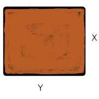
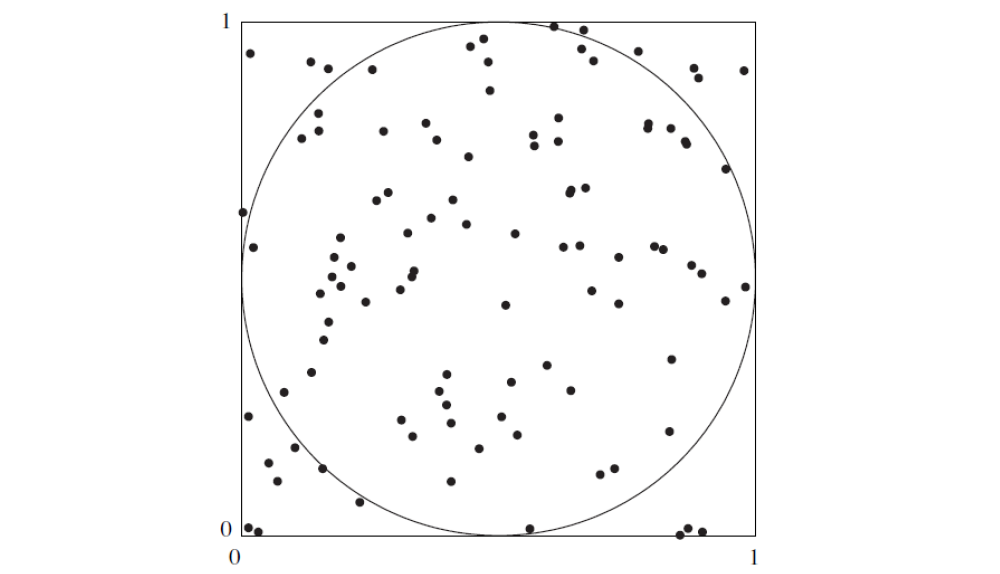

```{r setup, include=FALSE}
library(learnr)
knitr::opts_chunk$set(echo = FALSE,
                 exercise.warn_invisible = FALSE)
```


</br>

```{r, echo=FALSE, out.width="100%", fig.align = "center"}
knitr::include_graphics("images/banner1.jpg")
```

</br></br>

## Presentación 

El presente Taller contiene tres situación reales en que se utiliza R que pretenden realizar un primer acercamiento a este lenguaje estadísitco

</br>

##### **Qué es R** 

```{r, echo=FALSE, out.width="10%", fig.align = "center"}

```


Es un lenguaje para la computación estadística, utilizado para el procesamiento de información y generación de modelos estadísticos. Entre las principales características están:

   + Licencia (GNU GPL)  abierta y gratis
   
   + Creciente popularidad en Ciencia de Datos

   + Multiplataforma (UNIX, Windows, MacOS)

   + Ross Ihaka y Robert Gentleman (U. Auckland - Nueva Zelanda), 1993

   + Lenguaje multiparadigma
   
   + Código construido en C y Fortran
   
   + Gran comunidad muy activa 
   
   + Más de 7000 paquetes 


</br>

## Tema 1

### Ejercicios de análisis de datos

**1. Importar datos en R**  : Se puede realizar de formas diferentes :
 

1. Cargar bases de datos contenidas al interior de un paquete de R

2. Utilizando el menú RStudio 
  + Caso formato .csv : *File /Import Dataset/From text (base)*. 
  + Caso formato .xlsx : *File/ Import Dataset/ From Excel*. 

3. Utilizando el paquete `Rcmdr` y `RcmdrMisc`, que activa una interfaz de R que trabaja con menús y ventanas con un proceso parecido al anterior

Los casos anteriores implican que tengamos la base de datos descargada en una carpeta de nuestro PC.

4. Podemos importar la base de datos desde un repositorio que use API. En este caso, debemos solicitar un token e instalar el paquete `RSocrata`.

</br></br>

Caso 1.  Importar data del interior de R

**iris**

```{r ej11, exercise=TRUE, exercise.lines = 15}


```

```{r ej11-hint}
data(iris)  # data set iris
boxplot(iris$Sepal.Length~iris$Species) # grafico de cajas
head(iris)  # visualiza data
summary(iris) # resumen de variables

```


```{r, echo=FALSE, out.width="70%", fig.align = "center"}

```

</br></br>

**Titanic**

```{r ej12, exercise=TRUE, exercise.lines = 15}


```

```{r ej12-hint}
install.packages("titanic")
library(titanic)
data("Titanic")

```

```{r, echo=FALSE, out.width="50%", fig.align = "center"}

```

</br></br>


Caso 2. Importar datos desde un archivo csv en nuestro computador

+ Caso formato .csv : *File /Import Dataset/From text (base)*. 
+ Caso formato .xlsx : *File/ Import Dataset/ From Excel*.


</br></br>

Caso 3. Importar data del portal de bases de datos abiertos Colombia

**Covid-19**

```{r ej14, exercise=TRUE, exercise.lines = 15}

```


```{r ej14-hint}
install.packages("RSocrata", dependencies = TRUE)   # instalación de paquete RSocrata
library(RSocrata)    # llamado de libreria
token <- "zxMsD6eXc0zlEMryRGW87Hwrz"  # token
Colombia <- read.socrata("https://www.datos.gov.co/resource/gt2j-8ykr.json", app_token = token) # lectura 
saveRDS(Colombia, file = "Colombia.RDS")
```

## Tema 2

### Ejercicios de sumulación

#### **Problema 1** 

Se fabrican placas rectangulares cuyas longitudes en pulgadas se distribuyen como $N(2.0; 0.01)$ y cuyos anchos se distribuyen $N(3.0; 0.04)$. Suponga que las longitudes y los anchos son independientes. El área de una placa está dada por $A=XY$.

```{r, echo=FALSE, out.width="20%", fig.align = "center"}

```


a. Utilice una muestra simulada de tamaño $1000$ para estimar la media y la varianza de $A$.

b. Estime la probabilidad de que $P(5.9 <A<6.1)$.

c. Construya una gráfica de distribución normal $(qqplot)$ para el área. ¿El área de una placa sigue una distribución normal? 

Problema 3 capitulo 4 Navidi(2006) 

<br/>


```{r ej32, exercise=TRUE, exercise.lines = 15}


```

```{r ej32-hint}
n=1000
X2=rnorm(n,mean=2.0,sd=0.1)    #  generación de números aleatorios  de X
Y2=rnorm(n,mean=3.0,sd=0.2)    #  generación de números aleatorios  de Y
Z2=data.frame(X2,Y2)              #  generación de matriz de X,Y
A2=apply(Z2,1,prod)               #  área de la placa A=XY
mediaA=mean(A2)                   #  media del vector de áreas 
varianzaA=var(A2)                 #  varianza del vector de áreas 
B2=as.numeric(A2>5.9 & A2<6.1)    #  generación de variable de 0,1. 
                                  # Con valor de 1 cundo se cumple la condición y 
                                  #              0 en otros casos
Pro3c=sum(B2)/1000                #  cálculo de la  probabilidad 
hist(A2)                          # histograma del valor de las áreas
qqnorm(A2)      
```


<br/><br/><br/>

#### **Problema 2**

Estimación del valor de $\pi$ . LA siguiente figura sugiere como estimar el valor de $\pi$ con una simulación. En la figura, un circuíto con un áreaigual a $\pi/4$, está inscrito en un cuadrado cuya área es igual a 1. Se elige de forma aleatoria 100 puntos dentro del cuadrado . La probabilidad de que un punto esté dentro del círculo es igual a la pracción del área del cuadrado que abarca a este, la cual es $\pi/4$. Por tanto, se puede estimar el valor de $\pi/4$ al contar el número de puntos dentro del círculo, que es 79 para obtener la estimación de $\pi/4 \approx 0.76$ . De este último resultado se concluye que $\pi \approx 4(0.79) =3.14$ . Este ejercicio presenta un experimento de simulación que fue diseñado para estimar el valor de $\pi$ al generar 1000 puntos en el cuadrado.

<br/>

```{r, echo=FALSE, out.width="70%", fig.align = "center"}

```


<br/>

a. Genere 1000 coordenadas $x$:  $X_{1}$, . . . , $X_{1000}$. Utilice la distribución uniforme con valor mínimo de $0$ y valor máximo de $1$. La distribución uniforme genera variables aleatorias que tienen la misma probabilidad de venir de cualquier parte del intervalo $(0, 1)$.

b. Genere $1000$ coordenadas $y$ : $Y_{1}, . . . , Y_{1000}$, utilizando nuevamente la distribución uniforme con valor mínimo de $0$ y valor máximo de $1$.

c. Cada punto $(X_{i},Y_{i})$ se encuentra dentro del círculo si su distancia desde el centro $(0.5, 0.5)$ es menor a $0.5$. Para cada par $(X_{i},Y_{i})$ determine si la distancia desde el centro es menor a $0.5$. Esto último se puede realizar al calcular el valor $(X_{i}-0.5)^{2}+(Y_{i}-0.5)^{2}$, que es el cuadrado de la distancia, y al determinar si es menor que $0.25$.

d. ¿Cuántos de los puntos están dentro del círculo? ¿Cuál es su estimación de $\pi$? (Nota: Con sólo 1000 puntos, es probable que su estimación sea inferior por 0.05 o más. Una simulación con 10000 y 100000 puntos tiene mayores probabilidades de dar como resultado una estimación muy cercana al valor verdadero


```{r ej33, exercise=TRUE, exercise.lines = 15}

```


```{r ej33-hint}
n=10    # tamaño de la muestra
x=runif(n,0,1) # valor de x
y=runif(n,0,1) # valor de y

xy=data.frame(x,y) # matriz de pares (x,y)
disxy=function(x){  # funcion para calculo de distancia           
    disxy=(x[1]-0.5)^2+(x[2]-0.5)^2 
    disxy}
d=apply(xy,1,disxy)  # calculo de distancias por punto
npi=sum(as.numeric(d<=0.25)) # número de distancias que caen dentro de circulo
format(npi/n*4, nsmall=15 ) # aproximación de pi
```


<!-- BLOQUE_EVALUACION_ADM_MKT:INICIO -->
## Introduccion aplicada a administracion y mercadeo

En este modulo se conectan los conceptos estadisticos con decisiones de administracion y mercadeo: servicio al cliente, conversion comercial, eficiencia operativa, presupuesto y control de calidad. El objetivo es interpretar resultados cuantitativos para sustentar decisiones de negocio con criterio estadistico.

## Cuestionario de opcion multiple (respuesta unica)

### Nivel basico

```{r adm_modelos_q1}
question(
  "1) En una empresa de retail se quiere estimar la proporcion de clientes que recompran. ¿Que metodo en R es mas apropiado para un intervalo de confianza de una proporcion?",
  answer("t.test()", message = "t.test() se usa para medias, no para proporciones."),
  answer("prop.test()", correct = TRUE, message = "Correcto. prop.test() permite estimar intervalos para proporciones."),
  answer("var.test()", message = "var.test() compara varianzas."),
  answer("lm()", message = "lm() ajusta regresion; no es el metodo directo para este caso."),
  allow_retry = TRUE
)
```

<details>
<summary>Ayuda de codigo (pregunta 1)</summary>

```r
n <- 500
x <- 310
prop.test(x, n, conf.level = 0.95)
```

</details>

```{r adm_modelos_q2}
question(
  "2) Si en un estudio de tiempos de entrega se aumenta el nivel de confianza de 90% a 99%, manteniendo la misma muestra, el intervalo de confianza:",
  answer("Se hace mas estrecho", message = "No. Mayor confianza implica mayor amplitud."),
  answer("Permanece igual", message = "No. Cambia el valor critico."),
  answer("Se hace mas amplio", correct = TRUE, message = "Correcto. A mayor confianza, intervalo mas ancho."),
  answer("Solo cambia si n < 30", message = "No depende solo de esa condicion."),
  allow_retry = TRUE
)
```

<details>
<summary>Ayuda de codigo (pregunta 2)</summary>

```r
x <- c(70, 72, 75, 68, 74, 71, 69, 73, 76, 70)
n <- length(x)
s <- sd(x)
ancho90 <- diff(mean(x) + c(-1,1)*qt(0.95, n-1)*s/sqrt(n))
ancho99 <- diff(mean(x) + c(-1,1)*qt(0.995, n-1)*s/sqrt(n))
c(ancho90 = ancho90, ancho99 = ancho99)
```

</details>

```{r adm_modelos_q3}
question(
  "3) En un call center se mide el tiempo de atencion antes y despues de una capacitacion sobre los mismos asesores. ¿Que comparacion corresponde?",
  answer("Muestras independientes", message = "No. Son las mismas personas en dos momentos."),
  answer("Muestras pareadas", correct = TRUE, message = "Correcto. Es un diseno antes-despues pareado."),
  answer("Comparacion de proporciones", message = "Aqui se comparan medias de tiempo."),
  answer("Prueba de varianzas", message = "No es el objetivo principal en este caso."),
  allow_retry = TRUE
)
```

<details>
<summary>Ayuda de codigo (pregunta 3)</summary>

```r
antes <- c(52, 49, 55, 50, 48, 53, 51, 54)
despues <- c(48, 46, 50, 47, 45, 49, 48, 50)
t.test(antes, despues, paired = TRUE)
```

</details>

```{r adm_modelos_q4}
question(
  "4) Para estimar la media de ventas con varianza poblacional desconocida y n pequena, se utiliza tipicamente:",
  answer("Normal z", message = "No es la opcion principal cuando sigma es desconocida y n es pequena."),
  answer("t de Student", correct = TRUE, message = "Correcto. Se usa t para la media con sigma desconocida."),
  answer("Chi-cuadrado", message = "Chi-cuadrado se usa para varianza."),
  answer("F de Fisher", message = "F se usa para comparacion de varianzas."),
  allow_retry = TRUE
)
```

<details>
<summary>Ayuda de codigo (pregunta 4)</summary>

```r
ventas <- c(120, 118, 125, 130, 122, 119, 127, 121, 124, 126)
t.test(ventas, conf.level = 0.95)
```

</details>

```{r adm_modelos_q5}
question(
  "5) En mercadeo, el IC del 95% para (p_campanaA - p_campanaB) fue (-0.02, 0.06). ¿Que conclusion es correcta?",
  answer("La campana A es claramente superior", message = "No. El intervalo incluye 0."),
  answer("La campana B es claramente superior", message = "No hay evidencia concluyente de superioridad."),
  answer("No hay evidencia concluyente de diferencia", correct = TRUE, message = "Correcto. Al incluir 0, la diferencia puede ser nula."),
  answer("La campana A supera a B en 4 puntos exactos", message = "No. Ese valor puede estar dentro, pero no es exacto."),
  allow_retry = TRUE
)
```

<details>
<summary>Ayuda de codigo (pregunta 5)</summary>

```r
n1 <- 400; x1 <- 168
n2 <- 400; x2 <- 160
prop.test(c(x1, x2), c(n1, n2))$conf.int
```

</details>

### Nivel intermedio

```{r adm_modelos_q6}
question(
  "6) Dos canales de venta tienen tamanos muestrales distintos y varianzas aparentemente diferentes. Para IC de diferencia de medias conviene usar:",
  answer("t.test(..., var.equal = TRUE)", message = "No es recomendable si las varianzas son distintas."),
  answer("t.test(..., var.equal = FALSE)", correct = TRUE, message = "Correcto. Welch es apropiado con varianzas desiguales."),
  answer("prop.test()", message = "prop.test() es para proporciones."),
  answer("cor.test()", message = "cor.test() evalua asociacion, no diferencia de medias."),
  allow_retry = TRUE
)
```

<details>
<summary>Ayuda de codigo (pregunta 6)</summary>

```r
canal_web <- c(58, 62, 60, 59, 64, 61, 63, 57)
canal_tienda <- c(55, 52, 57, 54, 53, 56, 58, 51, 59, 50)
var.test(canal_web, canal_tienda)
t.test(canal_web, canal_tienda, var.equal = FALSE)
```

</details>

```{r adm_modelos_q7}
question(
  "7) Un IC de 95% para el ticket promedio mensual de una unidad es (48, 52) y la meta minima es 50. ¿Que decision gerencial es mas prudente?",
  answer("Concluir cumplimiento asegurado", message = "No. El limite inferior es menor a 50."),
  answer("Concluir incumplimiento asegurado", message = "No. El limite superior supera 50."),
  answer("Reconocer incertidumbre y ampliar monitoreo", correct = TRUE, message = "Correcto. El intervalo cruza la meta."),
  answer("Descartar el estudio", message = "No. El estudio es util para decidir con cautela."),
  allow_retry = TRUE
)
```

<details>
<summary>Ayuda de codigo (pregunta 7)</summary>

```r
ic <- c(48, 52)
meta <- 50
list(IC = ic, meta = meta, cruza_meta = (ic[1] <= meta && meta <= ic[2]))
```

</details>

### Comentario final

Revise en cada caso el parametro estimado, los supuestos del modelo y la interpretacion gerencial de los intervalos de confianza antes de tomar decisiones de administracion y mercadeo.
<!-- BLOQUE_EVALUACION_ADM_MKT:FIN -->
